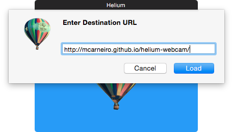
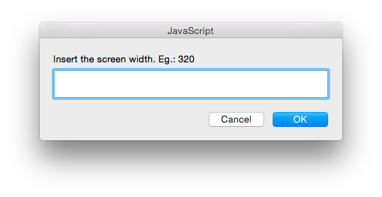
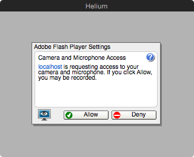
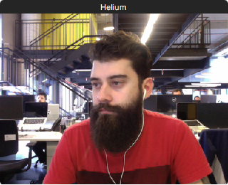

# Helium webcam 0.1.0

Simple page to show the webcam fixed in screencasts using the chromeless-and-floating browser window [Helium](https://github.com/JadenGeller/Helium).

## Why?

Usually I do simple screencasts with quicktime — and actually I want to keep that way. Sometimes I think it's useful to show my face but I didn't want to download (specially buy) specific software to do it.

## How?

Helium uses Safari that still doesn't support [getUserMedia](http://caniuse.com/#search=getUserMedia). So it's a simple HTML page with a embeded SWF. I got the file from a [random 2011 tutorial](http://www.kirupa.com/flash/getting_started_with_the_webcam.htm) because I really didn't want to download Flex and make it.

To use it just follow these simple steps:

1. [Download and run Helium](https://github.com/JadenGeller/Helium/releases);

2. Paste [http://mcarneiro.github.io/helium-webcam/]() on Helium;

    

3. `(optional)` By default, window will be 320x240. If you want to change the width and keep the proportion, press "s":    
_This will need to happen exactly at this moment, because you know, it's flash... so after clicking inside the swf embed the keyboard won't be listened anymore_

    

4. Give permission to flash:

    

5. That's it!

    
